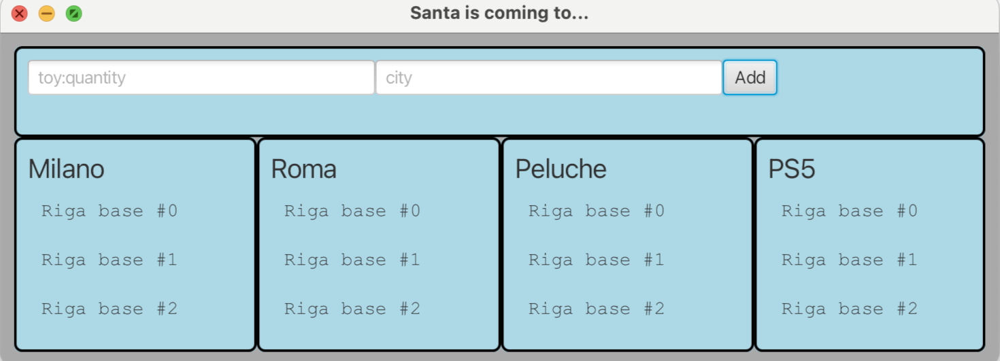
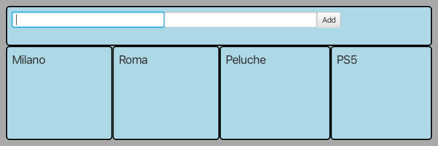
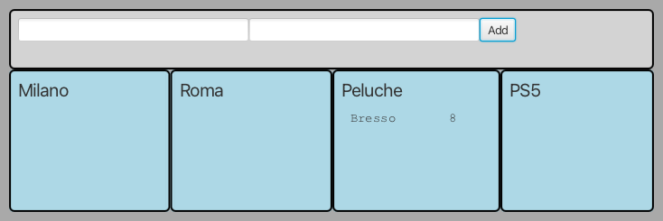
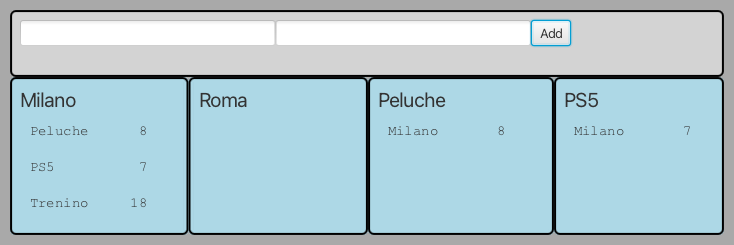
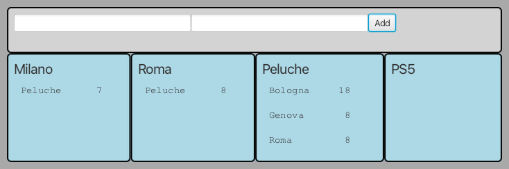
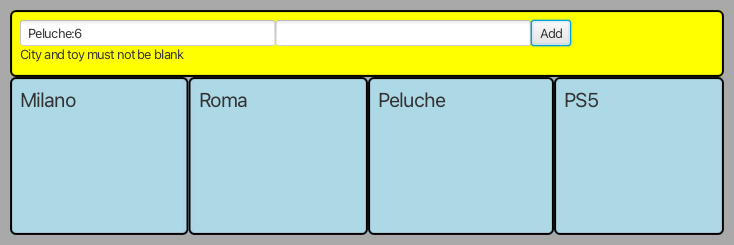
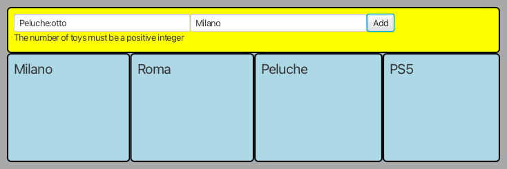
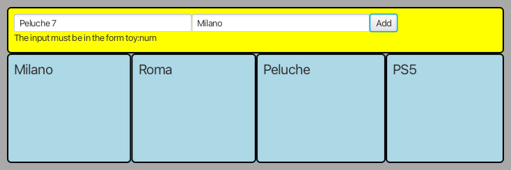

# CORSO INGEGNERIA DEL SOFTWARE A.A. 2024/25

## LABORATORIO 12 (valutato)

* TEAMMATE 1: <Cognome> <Nome> <matricola>
* TEAMMATE 2: <Cognome> <Nome> <matricola>

Ogni coppia di studenti effettua il **fork** di questo repository.
L'utente che ha effettuato il fork modifica questo README inserendo le opportune **informazioni sui
membri del team** seguendo lo schema sopra riportato.
Inoltre, concede i permessi di scrittura al proprio compagno di team e i **permessi di lettura** ai
docenti (`carlo.bellettini` e `mattia.monga`).

## Santa Claus is coming to town

Il Ministero delle Finanze ha deciso di tenere sotto controllo il traffico di
doni portati da Babbo Natale, allo scopo di aggiornare i dati del Redditometro 
su base geografica.
Obiettivo dell'esercizio è progettare e realizzare un insieme di classi atte a
produrre un semplice programma Java che permetta di monitorare la consegna dei
giocattoli nelle varie città.

Vengono già fornite due *Viste*:

- [`InputSanta`](src/main/java/it/unimi/di/sweng/lab12/view/InputSanta.java): mette a disposizione due caselle di testo
  (giocattoli e città) per segnalare la consegna di una determinata quantità di un certo giocattolo in una specifica città.
- [`DisplayView`](src/main/java/it/unimi/di/sweng/lab12/view/DisplayView.java): permette di visualizzare un elenco di righe di testo.

Viene fornita anche una prima versione della classe  [`Main`](src/main/java/it/unimi/di/sweng/lab12/Main.java) che
permette d'istanziare la parte statica delle viste, e di una
interfaccia [`InputPresenter`](src/main/java/it/unimi/di/sweng/lab12/presenter/InputPresenter.java).

**TUTTE LE CLASSI DATE POSSONO ESSERE DA VOI MODIFICATE (CANCELLATE, COMPLETATE) PER ADERIRE A VOSTRE IDEE DI
PROGETTAZIONE**

Lanciando il programma (tramite il task `run` di gradle) si ottiene una interfaccia simile a quella nella figura
sottostante.

## TRACCIA

Completare, in modo da realizzare un'organizzazione del sistema di tipo
*Model-View-Presenter*, aggiungendo le classi necessarie affinché:

- Una vista di input permetta di inserire il nome di un giocattolo e la quantità (prima casella di testo; giocattolo e quantità sono separati da ":"), il nome di una città (seconda casella di input), segnalando la consegna
  di quella quantità di quel giocattolo in quella città.
- Una vista "Milano" permetta di visualizzare l'elenco di 3 giocattoli (i primi 3 in ordine alfabetico, ignorando la differenza fra minuscole e maiuscole) e le rispettive quantità consegnati a Milano.
- Una vista "Roma" permetta di visualizzare l'elenco di 3 giocattoli (i primi 3 in ordine alfabetico, ignorando la differenza fra minuscole e maiuscole) e le rispettive quantità consegnati a Roma.
- Una vista "Peluche" permetta di visualizzare l'elenco di 3 città e le rispettive quantità di Peluche consegnati in ciascuna città, ordinate per quantità decrescente (a parità secondo l'ordine alfabetico della città). 
- Una vista "PS5" permetta di visualizzare l'elenco di 3 città e le rispettive quantità di PS5 consegnate in ciascuna città, ordinate per quantità decrescente (a parità secondo l'ordine alfabetico della città).

Naturalmente anche consegne di giocattoli in città diverse o con altri giocattoli devono essere registrate correttamente.

Per ogni città, la quantità di giocattoli consegnati di un determinato tipo può essere indicata solo una volta:
eventuali tentativi di sovrascrittura o aggiunta devono essere rifiutati e segnalati come errore.

Dovranno inoltre essere segnalati almeno i seguenti errori (di alcuni c'è anche la dizione aspettata scritta nei test di integrazione forniti):

- Se l'input è fornito in un formato non corretto (ad esempio, manca il carattere ":" per separare il giocattolo dalla quantità o la quantità non è un numero intero)
- Se si tenta di consegnare una quantità negativa di giocattoli
- Se si tenta di consegnare una quantità di giocattoli maggiore di 100
- Se si tenta di consegnare una quantità **totale** di giocattoli maggiore di 100 nella stessa città 
- Se si sta tentando di consegnare un giocattolo già presente in quella città

### Esempio di esecuzione

Alla partenza ci dovremo trovare nella seguente situazione ripulita:

Dopo avere indicato la consegna di 8 Peluche a Bresso...(aggiornamento vista città)

Dopo avere indicato la consegna di 8 Peluche a Milano... (aggiornamento di entrambi i tipi di vista)

Dopo avere indicato la consegna di 7 PS5, 18 Trenino e 8 Peluche a Milano... (attenzione all'ordine di presentazione)

Dopo avere indicato la consegna di 7 Peluche a Milano, 18 Peluche a Bologna, 
8 Peluche a Roma e 8 Peluche a Genova... (attenzione all'ordine di presentazione)

### Gestione input errati

Nel caso in cui l'utente inserisca un input non valido (ad esempio una stringa vuota, un numero negativo, etc.) il sistema
deve mostrare un messaggio di errore (tramite il metodo `showError`) nella vista appropriata.

Per esempio, se manca la città:

Se la quantità non è un numero decimale intero:

Se manca il separatore:

### Processo

Una volta effettuato il **clone** del repository, il gruppo completa l'implementazione seguendo la *metodologia TDD*;
in maggior dettaglio, ripete i passi seguenti fino ad aver implementato tutte le funzionalità richieste:

* scelta la prossima funzionalità richiesta da implementare, inizia una feature di gitflow
* implementa un test per la funzionalità,
* verifica che **il codice compili correttamente**, ma l'**esecuzione del test fallisca**; solo a questo punto effettua
  un *commit*
  (usando `IntelliJ` o `git add` e `git commit`) iniziando il messaggio di commit con la stringa `ROSSO:`,
* aggiunge la minima implementazione necessaria a realizzare la funzionalità, in modo che **il test esegua con
  successo**; solo a questo punto
  effettua un *commit* (usando `IntelliJ` o `git add` e `git commit`) iniziando il messaggio di commit con la
  stringa `VERDE:`,
* procede, se necessario, al **refactoring** del codice, accertandosi che le modifiche non
  comportino il fallimento di alcun test; solo in questo caso fa seguire a ogni
  passo un *commit* (usando `IntelliJ` o `git add` e `git commit`)
  iniziando il messaggio di commit con la stringa `REFACTORING:`,
* ripete i passi precedenti fino a quando non considera la funzionalità realizzata nel suo complesso e allora chiude la
  feature di gitflow
* effettua un *push* dei passi svolti su `gitlab.di.unimi.it` con `IntelliJ` o`git push --all`.
* effettua un *push* di tutti i tag `gitlab.di.unimi.it` con `IntelliJ` o`git push --tags`.

### Testing

Mano a mano che si sviluppa il progetto, si deve controllare che, tramite i test di unità, si riesca a mantenere una 
copertura, sia dei comandi che delle decisioni, soddisfacente (se inferiore al 100% inserire un commento che spieghi 
perché non è possibile raggiungerlo).

Sono presenti anche alcuni test di integrazione, ma potete aggiungerne altri  se vi servono per 
verificare correttezza del vostro codice dedicato a configurare e collegare (integrare appunto) i vari componenti.

### RELEASE

Durante lo sviluppo avete alcune release da fare (con gitflow e da pushare su gitlab):

- prima release quando per la prima volta chiuderete una feature dopo le 17:00
- ultima release quando consegnate PRIMA delle 18:30.

Al termine del laboratorio impacchettate l'ultima versione stabile come una
release di gitflow chiamata "**CONSEGNA**" comprendente tutte le feature completate ,
poi effettuate un ultimo *push* (`git push --all`) anche di tutti i rami locali (comprese eventuali
feature aperte ma non completate). Ricordate di fare push anche dei tag (`git
push --tags`). ATTENZIONE: è molto importante che esista un tag **CONSEGNA** che
indichi senza ambiguità il prodotto finale da valutare.

Suggeriamo di **verificare su gitlab.di.unimi.it** che ci sia la
completa traccia dei *commit* effettuati, dei branch *main* e *develop* e di averne dato visibilità ai docenti.

## NOTE

Per ogni coppia può essere usato un solo device (computer, telefono, tablet, schermo...).

Potete consultare appunti, libri, siti web, comprese chat con AI (tipo chatGPT...) ma non potete scambiare informazioni,
parlare, scrivere a, porre domande, ricevere aiuti o suggerimenti da parte di persone interne o esterne alla classe che 
non siano il vostro compagno di coppia,i professori o il tutor del corso.

Chiudete quindi subito (pena esclusione immediata e non trattabile dalla prova e eslusione dall'accesso alla rete in 
tutte le prove successive) programmi/pagineWeb tipo telegram, whatsapp, email, slack, zulip, forum, ...
